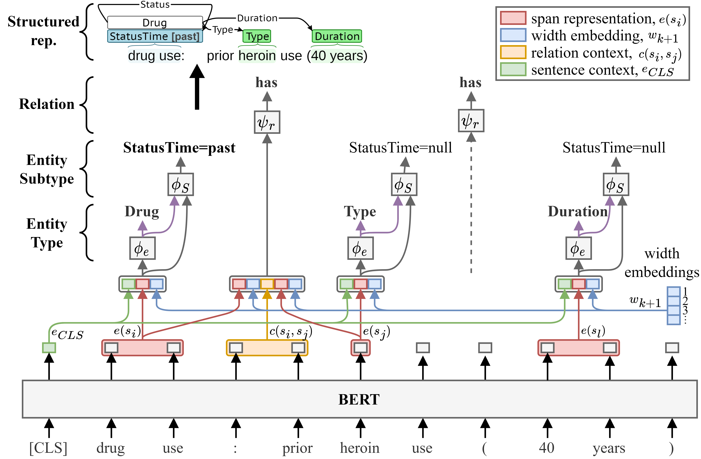

# Social Determinants of Health Event Extraction

## Background
This repository trains and evaluates a deep learning information extraction model for extracting event-based representations of social determinants of health (SDOH) from clinical text. In previous work, we introduced the Social History Annotated Corpus (SHAC), which consists of clinical text with detailed event-based annotations for SDOH events such as alcohol, drug, tobacco, employment, and living situation [1]. SHAC was the benchmark gold standard dataset from the 2022 National NLP Clinical Challenges SDOH extraction task (n2c2/UW SDOH Challenge) [2]. In this repository, we introduce the Multi-label Span-based Entity and Relation Transformer (mSpERT), which we train and evaluate on SHAC [3]. This repository contains a pipeline for importing SHAC into a Python data structure, training mSpERT on SHAC, and evaluating mSpERT on SHAC.

mSpERT is an augmented version of the original [Span-based Entity and Relation Transformer](https://ebooks.iospress.nl/volumearticle/55116) (SpERT) model developed by Eberts and Ulges [4]. SpERT jointly extracts entities and relations using BERT with output layers that classify spans and predict span relations. SpERT's span-based architecture allows overlapping span predictions but only allows a single label to be assigned to each span; however, the SHAC annotations frequently assign multiple labels to a single span. To adapt SpERT to SHAC, we developed mSpERT. We added additional classification layers to SpERT to accommodate multi-label span label. Figure 1 presents the mSpERT framework, which includes three classification layers: 1) Entity Type, 2) Entity Subtype, and 3) Relation.  The Entity Type and Relation layers are identical to the original SpERT, and the Entity Subtype layer is incorporated to generate multi-label span predictions.  mSpERT was developed by cloning the [original SpERT GitHub repository](https://github.com/lavis-nlp/spert).



__Figure 1: Multi-label Span-based Entity and Relation Transformer (mSpERT)__

## Data (updated 11/07/2023)
SHAC consists of de-identified clinial text from MIMIC-III and the University of Washington (UW) that is annotated for SDOH. SHAC was used as gold standard data in the 2022 n2c2/UW SDOH Challenge. SHAC is currently only available to individuals that participated in the challenge. *SHAC will be made publicly available in 2024 through a data use agreement and PhysioNet credentialing.* We apologize for the delayed release and are currently working to finalize the necessary agreements with our legal team. 

If you have any questions, please let us know,
Kevin Lybarger ([klybarge@gmu.edu](mailto:klybarge@gmu.edu))
Meliha Yetisgen ([melihay@uw.edu](mailto:melihay@uw.edu))

## Trained Models
Trained mSpERT SDOH extraction models are available. To access the trained models, please email both Kevin Lybarger ([klybarge@gmu.edu](mailto:klybarge@gmu.edu)) and Meliha Yetisgen ([melihay@uw.edu](mailto:melihay@uw.edu)).

## Requirements
1. _mSpERT_ - This repository includes the code needed to load SHAC, process it into mSpERT format, and train and evaluate mSpERT. The mSpERT code is housed in a separate repository and should downloaded or cloned from: [https://github.com/Lybarger/mspert](https://github.com/Lybarger/mspert). 
2. _Evaluation_ - This repository utilizes the scoring routine from the n2c2/UW SDOH Challenge. Instructions for pip installing the scoring routine are available at:  [https://github.com/Lybarger/brat_scoring](https://github.com/Lybarger/brat_scoring).
3. _Requirements doc_ - A requirements document, [requirements.txt](requirements.txt), is included for the remaining dependancies.


## Pipeline

### BRAT Import
SHAC is annotated in BRAT format. The SHAC corpus can be imported into a Python-based data structure as follow:
```
python import_corpus.py --source /path/to/challenge/data/directory/ --output_file /path/to/corpus.pkl
```

### Extraction Model

#### Training
mSpERT can be trained on SHAC using the `train_mspert.py` script. Below is example useage:

```
python train_mspert.py --source_file /home/lybarger/sdoh_challenge/output/corpus.pkl  --destination /home/lybarger/sdoh_challenge/output/model/ --mspert_path /home/lybarger/mspert/ --model_path "emilyalsentzer/Bio_ClinicalBERT" --tokenizer_path "emilyalsentzer/Bio_ClinicalBERT" --epochs 10 --train_subset train --valid_subset dev --train_source None --valid_source uw
```

The trained model and relevant configuration files are saved in "/path/to/output/directory/save/".


#### Inference
The trained mSpERT model can be used in inference using `infer_mspert.py`, which has two modes of operation (`mode` argument). In `eval` mode, the trained mSpERT model is applied to the annotated SHAC data for evaluating performance. In the `predict` mode, the trained mSpERT model is applied to a directory of unlabeled text and no evaluation is performed. In both `eval` and `predict` mode, the script will save the predictions in a JSON mSpERT format. The predictions can also be saved in BRAT format (`save_brat` is True).

*Evaluation*
Below is example usage for applying a trained extractor to data with BRAT labels (i.e. SHAC):
```
python infer_mspert.py --source_file /home/lybarger/sdoh_challenge/output/corpus.pkl --destination /home/lybarger/sdoh_challenge/output/eval/ --mspert_path /home/lybarger/mspert/ --mode eval --eval_subset dev --eval_source uw --model_path /home/lybarger/sdoh_challenge/output/model/save/ --device 0
```

*Prediction*
Below is example usage for applying a trained extractor to a directory of text (\*.txt) files. NOTE that the model has only been trained and evaluated on social history section text. The directory of text files should be limited to social history section text, to avoid false positives.
```
python infer_mspert.py --source_dir /home/lybarger/data/social_determinants_challenge_text/ --destination /home/lybarger/sdoh_challenge/output/predict/ --mspert_path /home/lybarger/mspert/ --mode predict --model_path /home/lybarger/sdoh_challenge/output/model/save/ --device 0
```

## References
1. K. Lybarger, M. Ostendorf, and M. Yetisgen. Annotating social determinants of health using active learning, and characterizing determinants using neural event extraction. Journal Biomedical Informatics, 113:103631, 2021. doi: [10.1016/j.jbi.2020.103631](https://doi.org/10.1016/j.jbi.2020.103631).
2. K. Lybarger, M. Yetisgen, and Ö. Uzuner. The 2022 n2c2/UW shared task on extracting social determinants of health. Journal American Medical Informatics Association, 2023. doi: [10.1093/jamia/ocad012](https://doi.org/10.1093/jamia/ocad012).
3. K. Lybarger*, N. J. Dobbins*, R. Long, A. Singh, P.Wedgeworth, O. Ozuner, and M. Yetisgen. Leveraging natural language processing to augment structured social determinants of health data in the electronic health record. under review, 2023. doi: [10.48550/arXiv.2212.07538]().
4. Eberts M, Ulges A. Span-Based Joint Entity and Relation Extraction with Transformer Pre-Training. In: European Conference on Artificial Intelligence; 2020. p. 2006-13. Available from: [https://ebooks.iospress.nl/volumearticle/55116](https://ebooks.iospress.nl/volumearticle/55116).

*Authors contributed equally.
